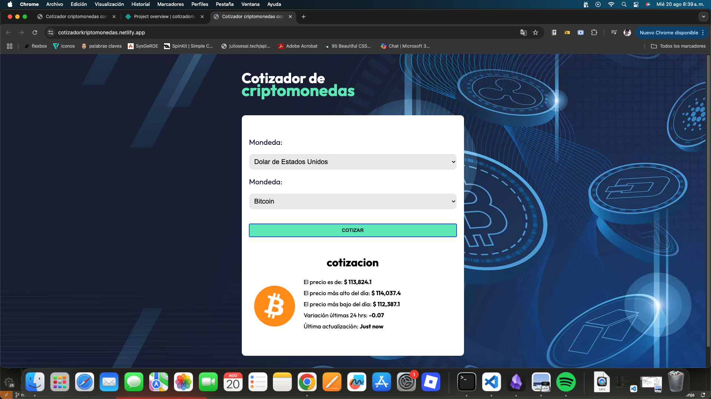

# 💹 APP - Cotizador de criptomonedas

Aplicación web para **cotizar criptomonedas** en tiempo real, desarrollada en **TypeScript** con **React**, utilizando **Zustand** para el manejo de estado global, **Zod** para validación de datos y **CSS** para estilos personalizados.

## 🌐 Demo en vivo
🔗 [Ver aplicación](https://visionary-eclair-4bbd5d.netlify.app/)
## 📸 Captura de pantalla


---

## 🚀 Características
- Consulta en tiempo real el precio de diferentes criptomonedas.
- Conversión a distintas monedas fiat (USD, EUR, MXN, etc.).
- Validación de entradas con **Zod**.
- Estado global con **Zustand**.
- Estilos limpios y responsivos con CSS.
- Arquitectura modular y escalable.

---

## 📦 Tecnologías utilizadas
- **React** + **TypeScript**
- **Zustand** (manejo de estado global)
- **Zod** (validación de datos)
- **CSS** (estilos personalizados)
- **API de cotizaciones de criptomonedas** (ej. CoinGecko o similar)

---

## ⚙️ Instalación y uso

1. **Clonar el repositorio**
   ```bash
   git clone https://github.com/tuusuario/crypto-quotes.git
   cd crypto-quotes
2. **Instala dependencias**
   npm install

3. **Configurar variables de entorno**
   Crea un archivo .env en la raíz del proyecto:
    .env
   crea la clave con tu apikey
    VITE_API_CRIPTO=https://api.coingecko.com/api/v3

4. **Ejecutar en modo desarrollo**
   npm run dev
5. **Compilar para producción**
   npm run build


